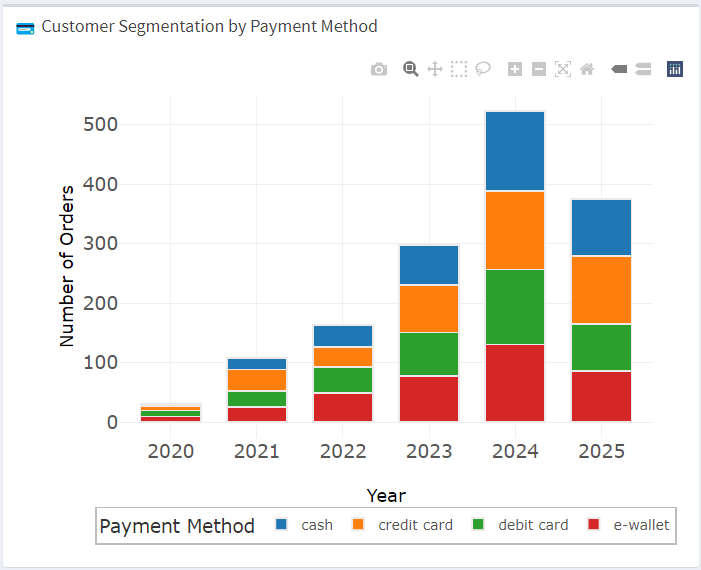
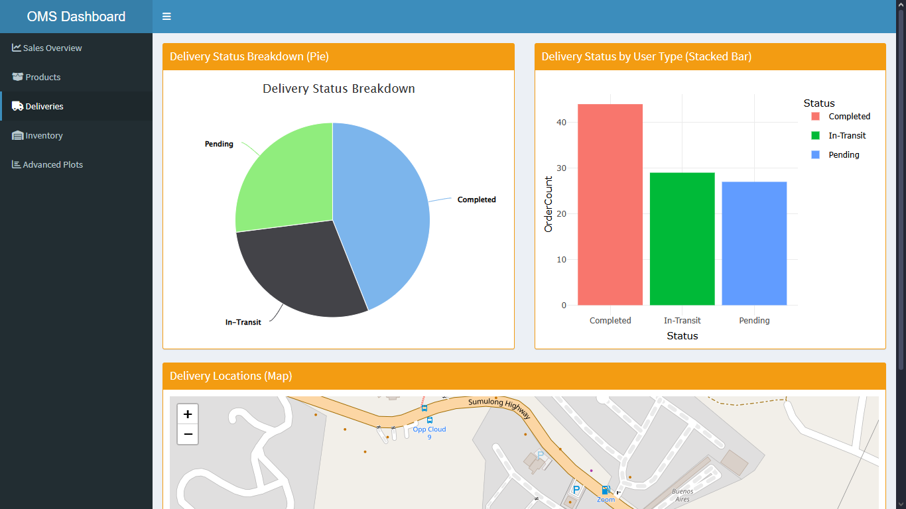

👀 About Me  @gitz1001

     
🌱 Currently learning **Data Science, Artificial Intelligence, and R for Data Visualization**  
🔭 Working on projects in **ETL, Business Information Systems, and Dashboard Design (Power BI, R Shiny, SQL)**  
💞️ Open to collaboration on **data-driven projects, business analysis, and full-stack development**   
⚡ Fun fact: *Coding is fun... until AI does it in 5 seconds — master using AI, not fight it.*  
📫 Reach me:  
  
  

 

🛠️ Tech Stack  

**Languages & Tools**  
  

**Frameworks & Platforms**  
  

**Collaboration & Productivity**  
  

🚀 Featured Projects 
🔹 [TrendLine Retail Dashboard](https://hadukin.shinyapps.io/TrendLine-Dashboard)
Interactive R Shiny dashboard for retail trend analysis and visualization  
    

🔹 [Power BI Sales Performance Dashboard](https://github.com/gitz1001/Online-Retail-Insights-and-Trends--Power-BI/blob/main/Online%20Retail%20II.pdf) – Sales trends, customer insights, and KPIs
    

🔹 [Inventory Management System](#) – UML, DFD diagrams & system design for a fitness center  
   

🔹 [Order Management Dashboard](https://hadukin.shinyapps.io/OMS-Prelims-Dashboard) – Interactive R Shiny dashboard connected to MySQL  
    

🔹 [VarSight](#) – Data-driven business solution with analytics  
    

📊 GitHub Stats 

  
  

<a class="badge-base__link LI-simple-link" href="https://ph.linkedin.com/in/edgar-baobaoen-jr?trk=profile-badge">Edgar Baobaoen Jr</a>

🌱 2025 Learning Roadmap  

- [x] Java Fundamentals  
- [x] R + Data Visualization  
- [ ] AI & Machine Learning (Python / R)  
- [ ] Cloud & ETL Pipelines (AWS, Azure, PostgreSQL)  
- [ ] Full-stack Dev for business apps  

💡 Beyond Tech  
- 🏀 Sports enthusiast | 🎨 Dashboards Hobbyist | 📚 Lifelong learner  
- 🎵 Productivity powered by Pop and Rock Beats  
- 🌍 Exploring how **tech + finance + design** shape the future  
  
  
  

✨ “Data tells stories, tech builds bridges, and I stand at the intersection of both.”  
