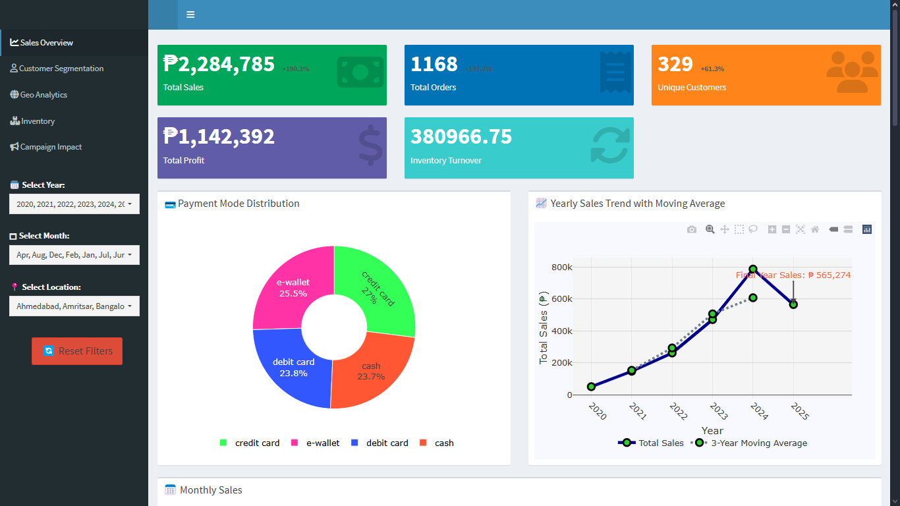
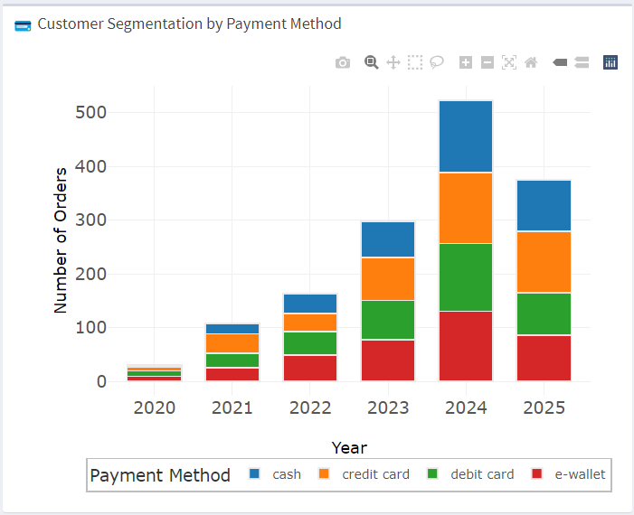
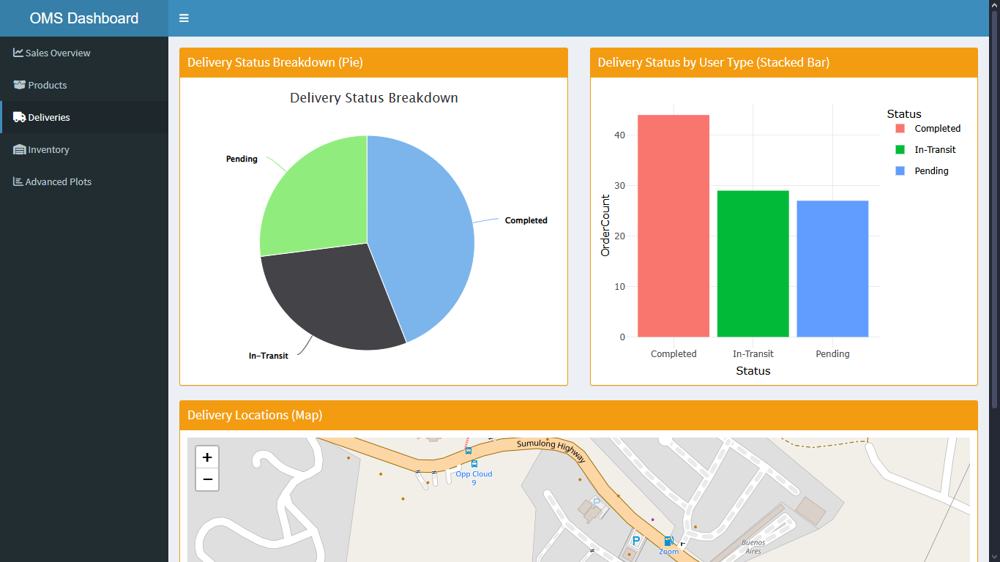

# 👋 Hi, I'm Edgar Baobaoen Jr.

### Data Science & Business Analytics • Full-Stack Development • Data-Driven Solutions

I build **data-driven software, dashboards, and business solutions** that turn data into useful insights and better decisions.

🎓 **BS Information Technology — Data Science & Business Analytics**  
🏆 **Cum Laude Graduate**  
💻 **Data Analytics • Business Analytics • Sports Analytics • Full-Stack Development • AI**

> **Data → Insight → Decision**

---

## 🧭 About Me

- 📊 Building projects around **data analytics, business intelligence, and decision support**
- 💻 Developing **full-stack web applications and business systems**
- 📈 Exploring **forecasting, predictive analytics, and financial markets**
- 🏀 Interested in **sports analytics and performance data**
- 🤖 Using AI to enhance development, automation, and productivity
- 🌱 Continuously learning by **building, experimenting, and solving real-world problems**

---
## 🛠️ Tech Stack

### 💻 Languages & Development

**Python** • **R** • **Java** • **JavaScript** • **TypeScript** • **SQL** • **HTML/CSS**

### 🌐 Frameworks & Platforms

**React** • **Next.js** • **Node.js** • **R Shiny** • **Tailwind CSS** • **Bootstrap**  
**Azure** • **Supabase** • **Vercel**

### 🤖 AI & Agentic Development

**OpenAI** • **Claude** • **Gemini** • **AI APIs** • **RAG** • **MCP**  
**AI Agents** • **Tool Calling** • **Prompt Engineering** • **AI-assisted Development**

### 📊 Data & Analytics

**Power BI** • **Pandas** • **NumPy** • **Matplotlib** • **R Shiny**  
**Data Visualization** • **Statistical Analysis** • **Predictive Analytics** • **Forecasting** • **ETL**

### 🗄️ Databases & Tools

**PostgreSQL** • **MySQL** • **MongoDB** • **Supabase**  
**Git** • **GitHub** • **Docker** • **VS Code** • **Figma**

### 🔄 Areas of Interest

**Sports Analytics** • **Financial Markets** • **Business Intelligence**  
**Full-Stack Applications** • **AI Applications** • **Automation**

# 🚀 Projects

## 📊 Data Science & Analytics

### 🔹 [TrendLine Retail Dashboard](https://hadukin.shinyapps.io/TrendLine-Dashboard)

Interactive **R Shiny dashboard** for retail trend analysis, visualization, and KPI exploration.

---

### 🔹 [Power BI Sales Performance Dashboard](https://github.com/gitz1001/Online-Retail-Insights-and-Trends--Power-BI)

Business intelligence project analyzing **sales performance, customer behavior, trends, and KPIs**.

---

## 💻 Full-Stack Development & Business Systems

### 🔹 VarSight

A data-driven **sports performance and management system** designed to centralize varsity team information, attendance, training records, game statistics, and analytics.

**Focus:** Sports Analytics • Business Information Systems • Performance Analytics • Dashboards

---

### 🔹 Inventory Management System

Business system project focused on **system analysis, UML, DFDs, database design, and application development**.

---

### 🔹 [Order Management Dashboard](https://hadukin.shinyapps.io/OMS-Prelims-Dashboard)

Interactive **R Shiny order management dashboard** connected to MySQL.

---

# 🧪 Hobby & Experimental Projects

Projects built to explore technologies, ideas, and things I find interesting.

### 📈 Financial Markets

Exploring **technical analysis, market data, trading systems, indicators, and quantitative concepts**.

### 🏀 Sports Analytics

Experimenting with **sports statistics, player performance, forecasting, and visualization**.

### 🤖 AI & Automation

Exploring tools that combine **AI, automation, software development, and productivity**.

### 🎨 Web & Creative Experiments

Building small projects around **web development, UI/UX, interactive experiences, and emerging technologies**.

---

# 📜 Certifications & Credentials

- 🏆 **Cum Laude Graduate**
- ☁️ **Microsoft Azure Fundamentals — AZ-900**
- 📊 **Microsoft Azure Data Fundamentals — DP-900**
- 📋 **Google Project Management Professional Certificate**
- 🌐 **Cisco Networking Academy Certifications**
- 💻 **Coursera Professional Development Certificates**
- 🏀 **UMak IT Skills Olympics 2025 — Participant**

---

# 📚 Learning Roadmap

### 2025

- ✅ Java Fundamentals
- ✅ R & Data Visualization
- ✅ AI & Machine Learning
- ✅ Cloud & ETL Concepts
- ✅ Full-Stack Development
- ✅ Business Information Systems

### 2026

- ✅ Data Analytics
- 🔄 Forecasting & Predictive Analytics
- 🔄 Statistical Techniques
- 🔄 Business Intelligence & Dashboard Design
- 🔄 KPI Design & Business Storytelling
- 🔄 Automation & Scheduling
- 🔄 Portfolio & Production Web Development

> I learn by **building projects, analyzing problems, and turning concepts into working systems.**

---

# 📫 Connect With Me

---

# 📊 GitHub Stats

---

# 🌟 Beyond Tech

- 🏀 Sports enthusiast
- 🎨 Hobbyist & creative builder
- 📚 Lifelong learner
- 🎵 Productivity powered by Pop & Rock
- 📈 Curious about financial markets
- 🌍 Exploring how **technology, data, finance, sports, and design** intersect

---

## 💡 What I'm Building Toward

**Data-driven software for sports, finance, and business.**

I’m interested in building systems where **software collects the data, analytics explains it, and design turns it into something people can actually use.**

> **“Data tells stories, tech builds bridges, and I build at the intersection of both.”**
